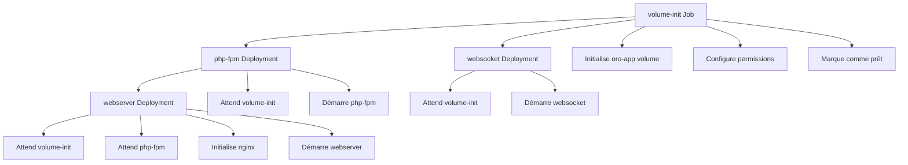

# Architecture d'Initialisation des Volumes OroCommerce

## Vue d'ensemble

Cette architecture garantit que les volumes OroCommerce sont correctement initialisés avant le démarrage des services applicatifs, en utilisant le pattern d'initialisation de Docker Compose adapté à Kubernetes.

## Composants

### 1. Chart `volume-init`

**Rôle** : Initialise les volumes partagés avant tous les autres services.

**Fonctionnalités** :
- Job Kubernetes avec hooks Helm (`pre-install`, `pre-upgrade`)
- Utilise l'image `oroinc/orocommerce-application:6.1.0`
- Exécute le `docker-entrypoint.sh` pour initialiser la structure
- Configure les permissions et propriétaires des fichiers

**Fichiers** :
```
charts/volume-init/
├── Chart.yaml
├── values.yaml
├── README.md
└── templates/
    ├── job.yaml
    ├── serviceaccount.yaml
    └── _helpers.tpl
```

### 2. InitContainers dans les autres charts

**Rôle** : Attendre que le volume-init soit terminé avant de démarrer.

**Charts modifiés** :
- `php-fpm` : Attend volume-init
- `websocket` : Attend volume-init  
- `webserver` : Attend volume-init + php-fpm

**Pattern utilisé** :
```yaml
initContainers:
- name: wait-for-volume-init
  image: bitnami/kubectl:latest
  command: ['sh', '-c', 'until kubectl get job {{ .Release.Name }}-volume-init-job -o jsonpath="{.status.succeeded}" | grep -q "1"; do echo "Waiting for volume initialization..."; sleep 10; done']
```

## Ordre d'exécution



## Sécurité

### ServiceAccounts et RBAC

Chaque chart a son propre ServiceAccount avec les permissions minimales :

```yaml
apiVersion: rbac.authorization.k8s.io/v1
kind: Role
rules:
- apiGroups: ["batch"]
  resources: ["jobs"]
  verbs: ["get", "list", "watch"]
```

### Images sécurisées

- `bitnami/kubectl:latest` pour les initContainers d'attente
- `oroinc/orocommerce-application:6.1.0` pour l'initialisation

## Configuration

### Variables d'environnement

```yaml
# volume-init/values.yaml
env:
  ORO_ENV: "prod"
  ORO_USER_RUNTIME: "www-data"
  ORO_APP_FOLDER: "/var/www/oro"

image:
  repository: oroinc/orocommerce-application
  tag: "6.1.0"
```

### Hooks Helm

```yaml
annotations:
  helm.sh/hook: "pre-install,pre-upgrade"
  helm.sh/hook-weight: "-10"
  helm.sh/hook-delete-policy: "before-hook-creation"
```

## Monitoring et Debugging

### Vérifier l'état du volume-init

```bash
# Vérifier le Job
kubectl get jobs -l app=volume-init

# Voir les logs
kubectl logs job/volume-init-job

# Vérifier le statut
kubectl describe job volume-init-job
```

### Vérifier les initContainers

```bash
# Voir les pods en cours d'initialisation
kubectl get pods -o wide

# Voir les logs des initContainers
kubectl logs <pod-name> -c wait-for-volume-init
```

## Avantages

1. **Ordre garanti** : Les hooks Helm assurent l'exécution en premier
2. **Réutilisabilité** : Le chart volume-init peut être utilisé par d'autres projets
3. **Sécurité** : Permissions minimales avec RBAC
4. **Observabilité** : Logs et statuts clairs
5. **Robustesse** : Retry et timeout configurables

## Déploiement

```bash
# Installer volume-init en premier
helm install volume-init ./charts/volume-init

# Installer les autres services
helm install orocommerce ./charts/orocommerce
helm install php-fpm ./charts/php-fpm
helm install websocket ./charts/websocket
helm install webserver ./charts/webserver
```

## Migration depuis Docker Compose

Cette architecture reproduit fidèlement le comportement du service `volume-init` de Docker Compose :

```yaml
# Docker Compose
volume-init:
  image: $ORO_IMAGE:$ORO_IMAGE_TAG
  command: -- true
  volumes:
    - oro_app:/var/www/oro

# Kubernetes equivalent
apiVersion: batch/v1
kind: Job
metadata:
  annotations:
    helm.sh/hook: "pre-install,pre-upgrade"
spec:
  template:
    spec:
      containers:
      - name: volume-init
        image: oroinc/orocommerce-application:6.1.0
        command: ["--", "true"]
``` 